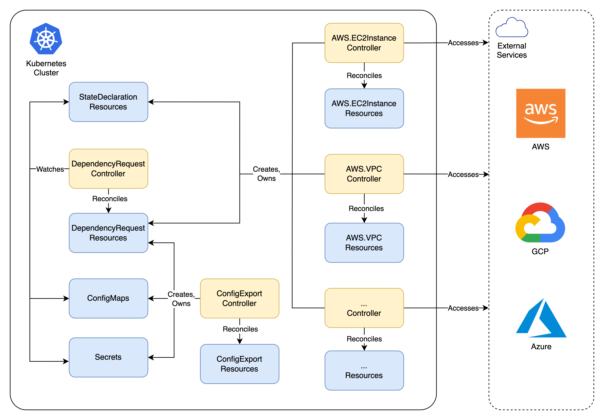
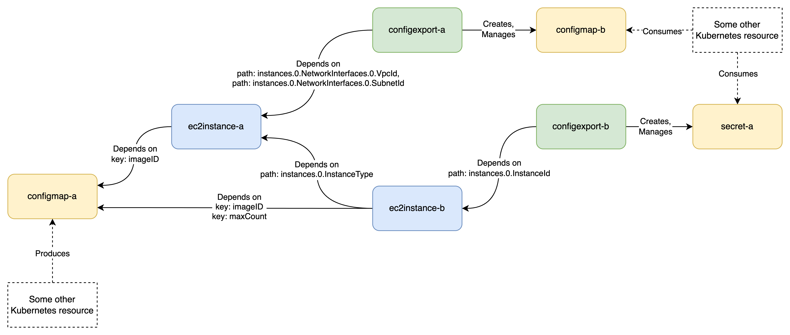
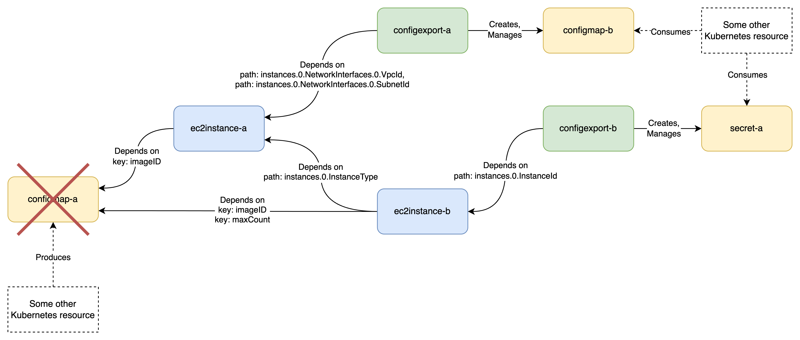

---
runme:
  id: 01HTW17VMH3NSECHM79QNF6JJ6
  version: v3
---

# Kraken Demo

## Architecture Overview



## What We'll Build



## Create Cluster

```sh {"id":"01HTW17VMH3NSECHM79ME36TSH","interactive":"true"}
kind create cluster --name kraken-demo
```

## Install cert-manager

```sh {"id":"01HTWK33NZKQ80B7S4B3B1KPY7"}
kubectl apply --filename https://github.com/cert-manager/cert-manager/releases/download/v1.14.4/cert-manager.yaml
kubectl wait --for=condition=Available \
    --namespace cert-manager \
    deployment/cert-manager \
    deployment/cert-manager-cainjector \
    deployment/cert-manager-webhook
```

## Install ArgoCD

```sh {"id":"01HTW3HPDY752JZX41EEXTKDA6","interactive":"true"}
kubectl create namespace argocd
kubectl apply --namespace argocd --filename https://raw.githubusercontent.com/argoproj/argo-cd/stable/manifests/install.yaml
kubectl wait --for=condition=Available --namespace argocd deployment/argocd-server --timeout=1m
```

```sh {"background":"true","id":"01HTW3MCTTZVMA6Z6F3N32SRQ6","interactive":"true","terminalRows":"2"}
kubectl port-forward --namespace argocd svc/argocd-server 8443:80
```

## Install Core Kraken Components

```sh {"id":"01HTW4TQBCFVK0HMNHYZ4CTGWD"}
kubectl apply --kustomize "https://github.com/kraken-iac/kraken//config/default/?version=v0.5.1"
kubectl wait --for=condition=Available --namespace kraken-system deployments/kraken-controller-manager
```

## Install EC2Instance Components

```sh {"id":"01HTX90VYKR5HSX2QR1PCKN5RY","terminalRows":"2"}
kubectl create namespace aws-ec2-instance-system
kubectl apply --kustomize aws-credentials
```

```sh {"id":"01HTWJTN3CKSRF3AJAF5A63NMZ"}
kubectl apply --kustomize "https://github.com/kraken-iac/aws-ec2-instance//config/default/?version=v0.1.1"
kubectl wait --for=condition=Available --namespace aws-ec2-instance-system deployments/aws-ec2-instance-controller-manager
```

## Create ConfigExports

```sh {"id":"01HVC6MYYTYHXG0JQYVX4AKVAB","interactive":"false","mimeType":"text/x-yaml"}
cat demo-config/configexport-a.yaml
```

```sh {"id":"01HVC6REQX0FF0MAAKEJC6Y10C","interactive":"false","mimeType":"text/x-yaml"}
cat demo-config/configexport-b.yaml
```

```sh {"id":"01HVC6JVNA8BX8Z8M1YKZWVCFJ","interactive":"false","terminalRows":"2"}
kubectl apply --filename demo-config/configexport-a.yaml
kubectl apply --filename demo-config/configexport-b.yaml
```

```sh {"id":"01HVC74X90Y237CY57KB77YX2Z","interactive":"false","mimeType":"text/x-yaml"}
kubectl get configexport configexport-a --output yaml
```

```sh {"id":"01HVC7AVHFZP9F34NM3VA81QEB","interactive":"false","mimeType":"text/x-yaml"}
kubectl get configexport configexport-b --output yaml
```

## Create EC2Instances

```sh {"id":"01HVC5EM77SXF66X5ZDS8B4Z8W","interactive":"false","mimeType":"text/x-yaml"}
cat demo-config/ec2instance-a.yaml
```

```sh {"id":"01HVC7SEWQHHDCQJ386321KJH2","interactive":"false","mimeType":"text/x-yaml"}
cat demo-config/ec2instance-b.yaml
```

```sh {"background":"false","id":"01HTXAP25TVPN5BEZY3SHYY8KY","interactive":"false","terminalRows":"1"}
kubectl apply --filename demo-config/ec2instance-a.yaml
kubectl apply --filename demo-config/ec2instance-b.yaml
```

```sh {"background":"false","custom":"[object Object]","id":"01HTX9J6S4N37PCG6PXYPRFGED","interactive":"false","mimeType":"text/x-yaml","terminalRows":"40"}
kubectl get ec2instance ec2instance-a --output yaml
```

```sh {"id":"01HVC7Z9XNCEHJHM46A4ZEC5Q6","interactive":"false","mimeType":"text/x-yaml"}
kubectl get ec2instance ec2instance-b --output yaml
```

## Current Progress



## Watch Statuses of All Dependent Resources

```sh {"background":"true","id":"01HVC60QVH3EWYVQAS6DDYVX6H","interactive":"true","mimeType":"text/plain","terminalRows":"6"}
kubectl get ec2instance ec2instance-a --output jsonpath='{.status}' --watch | yq --input-format json
```

```sh {"background":"true","id":"01HVCBNWZ90PNENRPT1S1J0M8J","terminalRows":"6"}
kubectl get configexport configexport-a --output jsonpath='{.status}' --watch | yq --input-format json
```

```sh {"background":"true","id":"01HVC898VGGAPJHRHNMPVJDJM5","interactive":"true","mimeType":"text/plain","terminalRows":"6"}
kubectl get ec2instance ec2instance-b --output jsonpath='{.status}' --watch | yq --input-format json
```

```sh {"background":"true","id":"01HVCBVSJXQEDZ9AQJBWSGW715","terminalRows":"6"}
kubectl get configexport configexport-b --output jsonpath='{.status}' --watch | yq --input-format json
```

## Create configmap-a

```sh {"id":"01HVC656CD9CWC27Z3H0JFAZWG","interactive":"false","terminalRows":"1"}
kubectl apply --filename demo-config/configmap-a.yaml
```

## Update configmap-a

```sh {"id":"01HVCQVXJZHRAWWR098R3D170W","interactive":"false","terminalRows":"1"}
kubectl patch configmap configmap-a --patch '{"data":{"maxCount":"2"}}'
```

## Delete All Resources

```sh {"id":"01HVCR4EZ7NYCDP8CXNGF4ABZD","interactive":"false"}
kubectl delete --filename demo-config
```

## GitOps with ArgoCD

```sh {"id":"01HVE3ZR9S68ZZYGBH1MNXJQCG"}
argocd_password=$(kubectl get secret --namespace argocd argocd-initial-admin-secret --template={{.data.password}} | base64 -d)

argocd login 127.0.0.1:8443 \
  --username admin \
  --password ${argocd_password} \
  --insecure

echo "ArgoCD Password: $argocd_password"
```

```sh {"id":"01HVE22CP3FCWSN7BTZE92M5WG"}
kubectl config set-context --current --namespace argocd
argocd app create my-infra \
  --repo https://github.com/kraken-iac/demo.git \
  --path demo-config \
  --dest-server https://kubernetes.default.svc \
  --dest-namespace default \
  --server 127.0.0.1:8443 \
  --insecure
```

## Cleanup

```sh {"id":"01HTW2XFH7F5677BE1W9A3V4SD"}
kind delete cluster --name kraken-demo
```